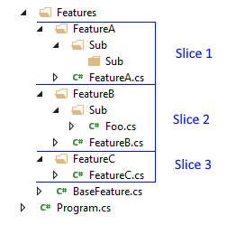
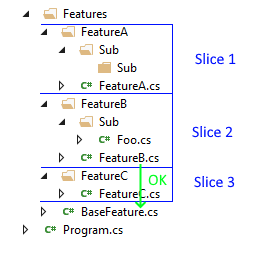
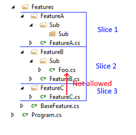

# NetArchTest.eNhancedEdition

A fluent API for .Net Standard that can enforce architectural rules in unit tests and create a *self-testing architecture*. Inspired by the [ArchUnit](https://www.archunit.org/) library for Java.

NetArchTest.eNhancedEdition is based on [NetArchTest v1.3.2](https://github.com/BenMorris/NetArchTest). If you are not familiar with NetArchTest, you should start by reading [introduction on Ben's blog](https://www.ben-morris.com/writing-archunit-style-tests-for-net-and-c-for-self-testing-architectures).

## Rationale

NetArchTest is well established mature library, but in order to push things forward, a few breaking changes had to be made, and that is how  **eNhancedEdition** has born. eNhancedEdition uses almost identical Fluent API as a base library, but it is not 100% backward compatible, and it will never be. The main goal is to offer more, and not to be a replacement.

## Getting started

The library is available as a package on NuGet: [NetArchTest.eNhancedEdition](https://www.nuget.org/packages/NetArchTest.eNhancedEdition/).

## Examples

```csharp
static readonly Assembly TestCreationAssembly = typeof(Foo).Assembly;

[TestMethod]
public void DomainIsNotAccessibleFromOutsideOfModule()
{
    var result = Types.InAssembly(AssemblyUnderTest)
                      .That()
                      .ResideInNamespace("MyApp.Domain")
                      .And()
                      .DoNotHaveNameEndingWith("Const")
                      .Should()
                      .NotBePublic()
                      .GetResult();
    Assert.IsTrue(result.IsSuccessful);
}

[TestMethod]
public void DomainIsIndependent()
{
    var result = Types.InAssembly(AssemblyUnderTest)
                      .That()
                      .ResideInNamespace("MyApp.Domain")
                      .ShouldNot()
                      .HaveDependenciesOtherThan( 
                        "System",                       
                        "MyApp.SharedKernel.Domain",
                        "MyApp.BuildingBlocks.Domain"
                      ) 
                      .GetResult(); 
   
    Assert.IsTrue(result.IsSuccessful, "Domain has lost its independence!");                           
}
```


## Writing rules

The fluent API should direct you in building up a rule, based on a combination of predicates, conditions and conjunctions. 

The starting point for any rule is the static `Types` class, where you load a set of types from a path, assembly.

```csharp
var types = Types.InAssembly(typeof(MyClass).Assembly);
```
Once you have selected the types you can filter them using one or more predicates. These can be chained together using `And()` or `Or()` conjunctions:
```csharp
types.That().ResideInNamespace(“MyProject.Data”);
```
Once the set of classes have been filtered you can apply a set of conditions using the `Should()` or `ShouldNot()` methods, e.g.
```csharp
types.That().ResideInNamespace(“MyProject.Data”).Should().BeSealed();
```
Finally, you obtain a result from the rule by using an executor, i.e. use `GetTypes()` to return the types that match the rule or `GetResult()` to determine whether the rule has been met. Note that the result will also return a list of types that failed to meet the conditions.
```csharp
var result = types.That().ResideInNamespace(“MyProject.Data”).Should().BeSealed().GetResult();
var isValid = result.IsSuccessful;
var types = result.FailingTypes;
```


## Dependencies 

## Slices 

```csharp
var result = Types.InAssembly(typeof(ExampleDependency).Assembly)
                  .Slice()
                  .ByNamespacePrefix("MyApp.Features")
                  .Should()
                  .NotHaveDependenciesBetweenSlices()
                  .GetResult();

```

There is only one way, at least for now, to divide types into slices `ByNamespacePrefix(string prefix)` and it works as follows:

1) Selects types which namespace starts with a given prefix, rest of the types are ignored.
2) Slices are defined by the first part of the namespace that comes right after the prefix:
`namespacePrefix.(sliceName).restOfNamespace`
3) Types with the same `sliceName` part will be placed in the same slice. If `sliceName` is empty for a given type, the type will be also ignored (`BaseFeature` class from folowing image)



When we already have our types divided into slices, we can apply only one available right now condition: `NotHaveDependenciesBetweenSlices()`. As the name suggest it detects if any dependencies exist between slices. Any dependency from slice to type that is not part of any other slice is allowed.

allowed | not allowed
--|---
|


## Custom rules

You can extend the library by writing custom rules that implement the `ICustomRule` interface. These can be applied as both predicates and conditions using a `MeetsCustomRule()` method, e.g.

```csharp
var myRule = new CustomRule();

// Write your own custom rules that can be used as both predicates and conditions
var result = Types.InCurrentDomain()
    .That()
    .AreClasses()
    .Should()
    .MeetCustomRule(myRule)
    .GetResult()
    .IsSuccessful;
```